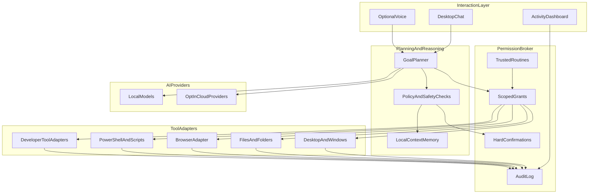

# Arbora

**A personalised digital assistant that understands your goals, respects your control, and automates your Windows system safely.**

[](#project-status)
[](#platform-strategy)
[](#license)
[](#privacy--data-ownership)

> **Vision stage.** Arbora is being designed and specified. There is no installable product yet. This README is the authoritative statement of product intent, safety posture, architecture direction, MVP scope, and collaboration path.

---

## Table of contents

- [Why Arbora](#why-arbora)
- [Project status](#project-status)
- [Who Arbora is for](#who-arbora-is-for)
- [What Arbora will do](#what-arbora-will-do)
- [How you interact with Arbora](#how-you-interact-with-arbora)
- [Core principles](#core-principles)
- [Priority experiences](#priority-experiences)
- [Capability map](#capability-map)
- [Autonomy and permissions](#autonomy-and-permissions)
- [Privacy and data ownership](#privacy--data-ownership)
- [Safety contract](#safety-contract)
- [Conceptual architecture](#conceptual-architecture)
- [Platform strategy](#platform-strategy)
- [AI runtime](#ai-runtime)
- [MVP definition](#mvp-definition)
- [Roadmap](#roadmap)
- [Out of scope (for now)](#out-of-scope-for-now)
- [Success criteria](#success-criteria)
- [Repository layout (proposed)](#repository-layout-proposed)
- [Documentation](#documentation)
- [Contributing](#contributing)
- [Security](#security)
- [License](#license)
- [Naming note](#naming-note)
- [Glossary](#glossary)

---

## Why Arbora

Modern computers are powerful, but most personal productivity still depends on brittle habits: opening the same apps every morning, hunting through downloads, re-running the same terminal commands, copying research into notes by hand, and remembering a dozen half-finished routines.

Existing assistants can chat. Existing automation tools can script. Few systems combine both in a way that is:

- **personal** — aware of your routines, preferences, and local context;
- **capable** — able to operate desktop apps, the browser, files, and the terminal;
- **trustworthy** — transparent about what it plans to do, and constrained by permissions you control;
- **local-first** — keeping personal memory and sensitive context on your machine by default.

**Arbora** aims to be that system: a Windows-first personal digital assistant that can plan, explain, and execute work on your computer—always under your rules, never as an invisible agent with unrestricted power.

The name *Arbora* (Latin for “tree”) reflects a living system that grows with you: roots in local context, a trunk of trusted routines, and branches into tools and workflows you deliberately grant.

---

## Project status

| Dimension | Current state |
| --- | --- |
| Product | Vision + Stage 1 prototype |
| Runnable application | CLI prototype (`arbora`) — not a packaged product |
| Install / setup docs | See [docs/install.md](docs/install.md), [docs/prototype.md](docs/prototype.md), and [CONTRIBUTING.md](CONTRIBUTING.md) |
| Near-term build order | [docs/NEXT.md](docs/NEXT.md) (source of truth for what we do next) |
| Public API | Not defined |
| License | [GPL-3.0](LICENSE) |
| Collaboration model | Open source |

This repository holds the product vision plus an early Stage 1 prototype: a permission broker, Windows adapters, a rule-based planner stub, and a CLI plan → approve → execute loop. Packaging and end-user documentation will mature toward MVP.

If you are evaluating Arbora as a user, contributor, or collaborator: treat this document as the source of truth for *what we intend to build* and *what we refuse to build*.

---

## Who Arbora is for

### Primary audience (v1)

**Individual power users** who want a personal assistant that saves real time on routine PC and work tasks—without surrendering control of their machine.

Typical users:

- people who start and end workdays with the same multi-app ritual;
- developers who repeat local setup, build, test, and triage steps;
- individuals who want help diagnosing everyday Windows issues without blindly running opaque “fixers”;
- anyone who wants research, files, and local automation coordinated through one conversational interface.

### Secondary audiences (later)

- technical users extending Arbora with custom tools and adapters;
- accessibility-focused workflows (hands-free / voice-first assistance);
- teams that want shared automation patterns (only after personal single-user foundations are solid).

### Not the initial focus

- enterprise fleet management;
- unsupervised multi-tenant SaaS agents;
- smart-home / IoT control as a first-class pillar;
- replacing professional IT / security products.

---

## What Arbora will do

Arbora is designed as a **personalised digital assistant + system automation layer**.

In plain terms, you should eventually be able to say things like:

> “Start my workday.”
>
> “Find why Discord won’t open and propose a safe fix.”
>
> “Clone this repo, create a virtual environment, install deps, and explain any failures.”
>
> “Research X, cite sources, and save a brief to my notes folder.”
>
> “Organise last week’s downloads using my filing rules—show me the plan first.”

…and Arbora should:

1. **understand** the request in context of your preferences and history;
2. **plan** a sequence of tool actions in language you can inspect;
3. **request approval** for new, sensitive, or high-impact steps;
4. **execute** trusted routines within the scopes you already approved;
5. **report** what happened, what failed, and what it learned (if learning is enabled).

Arbora is not a black-box autopilot. It is an assistant with a **permission broker** at the centre.

---

## How you interact with Arbora

### Primary surfaces

| Surface | Role |
| --- | --- |
| **Desktop chat** | Default control plane: ask, plan, approve, review, correct |
| **Optional voice** | Hands-free requests and confirmations when you choose to enable it |
| **Dashboard / activity feed** | See plans, approvals, running jobs, and audit history |
| **Hotkeys / quick actions** (later) | Trigger trusted routines without opening the full chat UI |

### Interaction loop

1. You state a goal (chat or voice).
2. Arbora proposes a plan with explicit tool steps and expected side effects.
3. You approve, edit, or reject the plan—or allow a matching trusted routine to proceed.
4. Arbora executes within granted scopes.
5. You get a clear outcome summary, with an audit trail you can reopen later.

Voice is an input modality, not a separate product. The same permission model applies whether you type or speak.

---

## Core principles

1. **User authority first**  
   Arbora may suggest and automate; it never claims ownership of your system.

2. **Local-first privacy**  
   Personal context lives encrypted on your device. Cloud models and sync are opt-in.

3. **Visible plans over silent magic**  
   Especially for new workflows, Arbora shows what it intends before it acts.

4. **Trusted routines, gated sensitivity**  
   Repeatable work can become autonomous after approval—but financial, credential, and destructive actions always need fresh confirmation.

5. **Provider-agnostic intelligence**  
   You choose local and/or cloud model providers. Arbora’s value is orchestration and safety, not lock-in to one AI vendor.

6. **Reversibility and auditability**  
   Prefer actions that can be undone or previewed. Keep a durable history of what ran and why.

7. **Windows-first, portable by design**  
   Ship deep Windows capability first; keep platform adapters clean so macOS/Linux can follow.

8. **Open source by default**  
   The core assistant and automation runtime are community-inspectable under GPL-3.0.

9. **Honest scope**  
   Ambition is welcome; claims of present capability are not. Vision ≠ shipped feature.

---

## Priority experiences

These are the first end-to-end journeys Arbora must eventually make delightful. They define product priorities more than feature checklists do.

### 1. Workday setup and shutdown

**Goal:** Reduce the friction of starting and ending focused work.

Examples:

- restore your usual apps, windows, and project folders;
- open the browser tabs or documents that belong to today’s focus;
- generate a short briefing from local notes, calendar cues (when connected), and unfinished tasks;
- at shutdown, save context, close non-essential apps, and park a “resume tomorrow” note.

**Success looks like:** one trusted routine that reliably prepares your environment without surprising side effects.

### 2. Computer troubleshooting (safe, explainable)

**Goal:** Help diagnose common Windows problems and propose understandable repairs.

Examples:

- “App X won’t launch—what changed?”
- “Disk space is critically low—what’s safe to clean?”
- “Network feels broken after the last update—run a read-only diagnostic.”

**Success looks like:** clear hypotheses, read-only investigation first, explicit repair plans, and no silent destructive fixes.

### 3. Developer assistance

**Goal:** Automate repeatable local development workflows and explain failures.

Examples:

- set up a project (clone, toolchain checks, env files from templates, install, run);
- execute approved build/test/lint commands;
- summarise compiler/test failures into actionable next steps;
- package recurring workflows into trusted routines.

**Success looks like:** Arbora becomes a reliable pair for local engineering chores without becoming an unsupervised production deployer.

---

## Capability map

Capabilities below are **product goals**, not present features. They are grouped by how central they are to the Arbora vision.

### Core (must exist for Arbora to feel real)

| Area | Intent |
| --- | --- |
| **Desktop & window control** | Launch, focus, arrange, and inspect applications |
| **Files & folders** | Search, move, rename, organise, preview—with user rules |
| **Browser tasks** | Navigate, extract, summarise, and assist with web workflows |
| **Terminal / PowerShell** | Run approved commands and scripts with clear output capture |
| **Planning & tool use** | Break goals into inspectable multi-step plans |
| **Permission broker** | Enforce scopes, trust, confirmations, and audit |
| **Local context memory** | Remember preferences/routines you choose to store |
| **Chat + optional voice** | Primary human interface |

### Strong supporting capabilities

| Area | Intent |
| --- | --- |
| **Personal organisation** | Tasks, reminders, notes, documents, and lightweight planning aids |
| **Web research** | Research topics, prefer cited synthesis, save briefs locally |
| **Local automation & scheduling** | Scripts, watchers, and time/context-triggered trusted routines |
| **Preference learning** | Opt-in learning of routines, styles, and goals over time |
| **Developer tooling adapters** | Git, editors, project scaffolds, issue/workflow helpers |

### Later / optional expansions

| Area | Intent |
| --- | --- |
| Calendar & email providers | Deeper personal organisation once desktop foundations are solid |
| Cloud storage providers | Sync and document workflows with explicit grants |
| Mobile companion | Remote approvals and status, not full remote desktop control |
| Smart-home / IoT | Explicitly deferred; not an MVP pillar |
| Cross-platform parity | macOS and Linux after Windows depth is proven |

---

## Autonomy and permissions

Arbora uses a **trusted-routine** autonomy model.

### Levels of authority

| Level | What Arbora may do | When it applies |
| --- | --- | --- |
| **Read / observe** | Inspect UI state, files (where allowed), logs, and system info | Default for diagnosis and planning |
| **Propose** | Draft plans, scripts, and messages without side effects | Always available |
| **Execute with approval** | Perform new or expanded tool sequences after you confirm | Default for new workflows |
| **Trusted routine** | Run a previously approved routine within fixed scopes | After you promote a successful workflow |
| **Hard confirmation** | Require a fresh, explicit yes—even inside trusted routines | Always for sensitive classes below |

### Always require fresh confirmation

Even after a routine is trusted, Arbora **must** stop and ask before:

- **Financial or purchase-related actions** (payments, checkouts, transfers, subscriptions);
- **Credential / private-data handling** (revealing, changing, exporting, or sharing secrets and private personal data);
- **Destructive or irreversible system/file actions** (permanent deletes, disk wipes, registry-destructive changes, irreversible account or OS configuration changes).

### What “trusted” means

A trusted routine is:

- named and inspectable;
- scoped to specific tools, paths, apps, and commands;
- versioned (changing the plan can revoke or require re-approval);
- auditable every time it runs;
- revocable in one place.

Trust is earned per routine—not a global “do anything” switch.

---

## Privacy and data ownership

**Default posture: local-first.**

| Data class | Default location | Notes |
| --- | --- | --- |
| Preferences & routines | Encrypted on device | User-controlled export/import later |
| Conversation history | Local by default | Retention policies user-configurable |
| Screen / UI observations | Ephemeral unless you save them | Not uploaded unless you opt in |
| Model inference | Local model and/or user-chosen cloud provider | Explicit provider selection |
| Telemetry | Off or minimal and transparent | No silent personal-content harvesting |

### Commitments

- Personal context is **encrypted at rest** on the local machine.
- Cloud AI providers are **opt-in**, not required for core product identity.
- Arbora should make it obvious **what left your machine**, when, and why.
- You should be able to **wipe local memory** without losing the application binary.
- Open-source inspection is part of the trust model: security-sensitive paths should remain reviewable.

### Non-commitments (honesty)

- Local-first does not mean “never talks to the network.” Browser research, package installs, and opted-in cloud models require network access.
- Encryption-at-rest does not replace endpoint security. If malware already controls your user session, no desktop assistant can fully protect you.

---

## Safety contract

This is the non-negotiable product contract. Features that violate it do not ship.

### Arbora will

- show plans for new or high-impact work;
- prefer **dry runs / previews** when feasible;
- keep an **audit trail** of actions, approvals, and outcomes;
- constrain tools through a **permission broker**;
- support **undo / restore** paths where the platform allows;
- fail closed on ambiguous high-risk intent (“I’m not sure—please confirm”).

### Arbora will not

- claim unrestricted or invisible computer control;
- silently perform financial, credential, or destructive actions;
- exfiltrate personal context to cloud services without explicit opt-in;
- present experimental vision capabilities as already shipped;
- encourage users to disable all confirmations as a “power mode” for sensitive classes.

### Safety UX expectations

- Approvals are readable by non-experts (“Will delete `Downloads/old/` permanently”).
- Risky steps are visually distinct from read-only steps.
- Voice confirmations for sensitive actions must be explicit and replayable in the audit log.
- Emergency stop: a clear way to halt running automation.

---

## Conceptual architecture

High-level shape (subject to implementation evolution):



### Layer responsibilities

| Layer | Responsibility |
| --- | --- |
| **Interaction** | Chat, voice, approvals UI, status, and history |
| **Planning & reasoning** | Turn goals into tool plans; use memory and model providers |
| **Permission broker** | The hard gate between intent and side effects |
| **Tool adapters** | Narrow, testable integrations with OS/apps |
| **Local context store** | Encrypted preferences, routines, and optional memories |
| **AI providers** | Pluggable local/cloud inference backends |

Design rule: **models propose; the broker disposes.** No tool adapter should be reachable by an LLM without going through policy and permissions.

---

## Platform strategy

| Phase | Platform stance |
| --- | --- |
| **Now / MVP** | Windows-first (deep integration with desktop, File Explorer, browser, PowerShell) |
| **Next** | Keep adapters behind interfaces; avoid Windows-only assumptions in core planner/broker |
| **Later** | macOS and Linux support when Windows depth and safety patterns are proven |

Windows is the first-class target because that is where Arbora can most quickly deliver tangible personal automation for the primary audience. Cross-platform ambition is architectural, not a promise of day-one parity.

---

## AI runtime

Arbora is **provider-agnostic**.

### Goals

- run with **local models** for privacy-sensitive or offline-capable workflows;
- allow users to connect **cloud providers** they choose;
- keep prompts, tools, and policies separable from any one vendor SDK;
- degrade gracefully when a provider is unavailable.

### Non-goals for the runtime

- forcing a single proprietary model;
- shipping a product identity that only works with one paid API;
- sending local memory to a cloud provider as a silent default.

Exact model packaging, hardware requirements, and recommended local runtimes will be documented when implementation begins.

---

## MVP definition

The MVP is intentionally narrower than the long-term vision. It exists to prove that Arbora can be **useful, controllable, and trustworthy** on a real Windows machine.

### MVP includes

- desktop chat interface with plan → approve → execute loop;
- optional basic voice input (nice-to-have, not a blocker if chat is excellent);
- Windows desktop/app/window control for common productivity apps;
- File Explorer-oriented file organisation with preview/plan;
- browser assistance for research and cited briefs saved locally;
- PowerShell/terminal execution under explicit scopes;
- permission broker with trusted routines + hard confirmations for financial / credential / destructive actions;
- encrypted local preference/routine storage;
- provider-agnostic model interface (at least one local path and one opt-in cloud path);
- first-class journeys:
  - workday setup / shutdown;
  - explainable PC troubleshooting;
  - developer project setup and repeatable local commands;
- audit log for actions and approvals.

### MVP excludes

- full calendar/email suite replacement;
- smart-home control;
- mobile remote control of the desktop;
- unsupervised always-on agent with global system rights;
- multi-user team administration features;
- macOS/Linux feature parity.

### MVP definition of done

An early tester can, on a clean Windows install of Arbora:

1. complete a workday setup routine after one guided approval;
2. run a read-only PC diagnostic and approve a safe repair plan;
3. set up a sample developer project through chat;
4. inspect the audit log and revoke a trusted routine;
5. keep personal memory local with cloud models disabled.

---

## Roadmap

Dates are intentionally omitted. Stages advance when the previous stage’s quality bar is met.

### Stage 0 — Vision and foundations

- product vision and safety contract (this document);
- repository bootstrap, licensing, contribution norms;
- architecture spikes for permission broker and Windows adapters.

### Stage 1 — Prototype (current)

- CLI chat shell + planner stub;
- first Windows tool adapters (apps, files, terminal) behind the broker;
- manual approval UX;
- local-only memory sketch;
- demo scripts for the three priority journeys (even if brittle).

See [docs/prototype.md](docs/prototype.md) for how to run what exists today.

### Stage 2 — MVP

- harden adapters and error handling;
- trusted routines + hard confirmation classes;
- audit log and dry-run/preview paths;
- provider-agnostic model wiring;
- packaging for early private testers.

### Stage 3 — Personal depth

- stronger preference learning (opt-in);
- richer research and organisation workflows;
- developer-tool adapters beyond the basics;
- scheduling / context triggers for trusted routines;
- polished voice experience.

### Stage 4 — Ecosystem expansion

- calendar/email/cloud-storage integrations with explicit grants;
- community-contributed adapters;
- macOS/Linux ports behind the same broker model;
- optional companion surfaces (hotkeys, browser extension, mobile approvals).

### Stage 5 — Mature personal OS assistant

- high reliability on daily routines;
- excellent undo/audit ergonomics;
- broad but still permissioned automation coverage;
- a contributor ecosystem that can extend Arbora without weakening the safety core.

---

## Out of scope (for now)

To keep Arbora coherent, the following are explicitly **not** near-term goals:

- replacing antivirus, EDR, or enterprise MDM products;
- fully autonomous financial management;
- stealth background control without a visible activity surface;
- training on user data for a central Arbora model without consent;
- smart-home / IoT as a launch pillar;
- guaranteeing perfect reliability for every arbitrary GUI app (adapters will expand deliberately).

If a proposed feature conflicts with the [safety contract](#safety-contract) or [core principles](#core-principles), it is out of scope regardless of demand.

---

## Success criteria

Arbora is succeeding when:

1. **Time saved is real** — workday, troubleshooting, and developer routines meaningfully reduce manual steps.
2. **Trust is earned** — users can explain what Arbora is allowed to do, and feel safe expanding that surface.
3. **Privacy defaults hold** — local-first remains the default, and cloud usage is conscious.
4. **Open contribution works** — outsiders can add adapters and improvements without forking around the broker.
5. **Honesty scales with ambition** — documentation never outruns reality.

Arbora is failing when:

- users fear surprise side effects;
- “just make it autonomous” becomes an excuse to weaken confirmations;
- the product becomes a thin chat wrapper over a single cloud vendor;
- vision marketing claims features that do not exist.

---

## Repository layout (proposed)

As implementation begins, the repository is expected to grow toward a structure similar to:

```text
arbora/
  README.md                 # this vision document
  LICENSE                   # GPL-3.0
  CHANGELOG.md              # per-file roles and one-line change summaries
  documentation/            # numbered commit change documents (NNN-*.md)
  docs/                     # design notes, ADRs, prototype notes
  apps/                     # desktop shell / UI
  src/arbora/               # Stage 1 Python package (core, adapters, memory, providers, cli)
  tests/                    # unit, integration, safety regression tests
  scripts/                  # developer and release helpers
```

Exact language and package boundaries continue to evolve in Stage 1. What must not change casually is the **permission broker boundary**.

---

## Documentation

Commit-tied change history lives in [`documentation/`](documentation/README.md). Each meaningful commit adds the next numbered file (`001-…`, `002-…`, …) and updates that index. Per-file roles and one-line change summaries live in [`CHANGELOG.md`](CHANGELOG.md). Design notes that are not commit-tied stay under [`docs/`](docs/). Near-term build order (what we do next) is **[docs/NEXT.md](docs/NEXT.md)**. Private-tester install: **[docs/install.md](docs/install.md)**.

| Latest | Document |
| --- | --- |
| 021 | [MVP validate CLI](documentation/021-mvp-validate-cli.md) |
| 020 | [Persistent audit log](documentation/020-persistent-audit-log.md) |
| 019 | [Desktop schedule UX](documentation/019-desktop-schedule-ux.md) |
| 018 | [Scheduled trusted routines](documentation/018-scheduled-trusted-routines.md) |
| 017 | [Workflow packs](documentation/017-workflow-packs.md) |
| 016 | [Opt-in cloud provider](documentation/016-opt-in-cloud-provider.md) |
| 015 | [File undo for organise moves](documentation/015-file-undo-organise.md) |
| 014 | [Richer browser actions](documentation/014-richer-browser-actions.md) |
| 013 | [Journey hardening](documentation/013-journey-hardening.md) |
| 012 | [Emergency stop](documentation/012-emergency-stop.md) |
| 011 | [Trust UX routines/audit](documentation/011-trust-ux-routines-audit.md) |
| 010 | [arbora doctor](documentation/010-arbora-doctor.md) |
| 009 | [Packaging and first-run](documentation/009-packaging-and-first-run.md) |
| 008 | [Setup and status lights](documentation/008-setup-and-status-lights.md) |
| 007 | [Tkinter desktop chat](documentation/007-tkinter-desktop-chat.md) |
| 006 | [Browser adapter (Playwright)](documentation/006-browser-adapter-playwright.md) |
| 005 | [Harden Windows adapters](documentation/005-harden-windows-adapters.md) |
| 004 | [Encrypted local memory](documentation/004-encrypted-local-memory.md) |
| 003 | [Trusted routines and local Ollama](documentation/003-trusted-routines-and-ollama.md) |
| 002 | [Commit documentation process](documentation/002-commit-documentation-process.md) |
| 001 | [Stage 1 prototype bootstrap](documentation/001-stage1-prototype-bootstrap.md) |

Full index: [documentation/README.md](documentation/README.md).

---

## Contributing

Arbora welcomes collaborators who care about useful automation *and* user agency.

### High-value contribution areas (once code lands)

- Windows UI automation adapters that are robust and least-privilege;
- permission broker / policy engine design and tests;
- local memory encryption and export/wipe flows;
- provider adapters (local runtimes and cloud APIs);
- UX for plans, approvals, audit, and emergency stop;
- safety regression tests for sensitive action classes;
- documentation, examples, and journey demos.

### Contribution norms

- Prefer small, reviewable changes with clear safety implications called out.
- Do not add tool capabilities that bypass the permission broker.
- Do not commit secrets, personal traces, or live credentials.
- Discuss large architectural changes before implementing them.
- Treat user-facing claims carefully: document intent vs. availability explicitly.
- On each commit, add the next numbered document under [`documentation/`](documentation/README.md), update this README’s Documentation section, and append per-file one-liners to [`CHANGELOG.md`](CHANGELOG.md).

Issue templates, a code of conduct, and contributor guidelines will be added as the repository leaves pure vision stage. Until then, use this README as the north star.

---

## Security

Desktop automation is powerful and therefore risky. Security is a product feature, not a paperwork afterthought.

### Expected practices

- least-privilege tool scopes;
- no plaintext long-term storage of secrets in memory or logs;
- clear separation between read-only diagnostics and mutating repairs;
- auditability of privileged operations;
- careful handling of prompt-injection risks from web/page/file content that attempts to coerce tool use.

### Reporting

A formal security policy (`SECURITY.md`) will land with the first runnable prototype. Until then, if you discover a vulnerability in design documents or early code:

1. do **not** open a public issue with exploit details;
2. contact the maintainers privately (contact method to be published with the first release);
3. allow reasonable time for assessment before public discussion.

Please do not request or contribute exploit payloads, malware, or instructions intended to attack systems.

---

## License

Arbora is intended to be released as **free software under the GNU General Public License v3.0 (GPL-3.0)**.

That means:

- you may use, study, share, and modify the software;
- derivative works that you distribute must also be available under GPL-compatible terms;
- there is no warranty—see the full licence text for details.

See the [`LICENSE`](LICENSE) file for the full GNU GPL v3.0 text.

---

## Naming note

The GitHub repository is **[Victor-Jnr/Arbora](https://github.com/Victor-Jnr/Arbora)**. A local checkout folder may still be named `Canopy_controller` if it was created under the previous working title—rename it to `Arbora` locally when convenient. Documentation and branding should use Arbora throughout.

---

## Glossary

| Term | Meaning |
| --- | --- |
| **Trusted routine** | A previously approved, scoped automation Arbora may run without re-planning every step |
| **Hard confirmation** | A fresh explicit approval required even inside trusted routines |
| **Permission broker** | Central gate that authorises tool side effects |
| **Adapter** | Integration module for a specific system surface (files, browser, terminal, etc.) |
| **Local-first** | Personal data and defaults live on-device; network/cloud features are opt-in |
| **Provider-agnostic** | Core product works with interchangeable local/cloud model backends |
| **Vision stage** | Design and intent documented; product not yet installable |
| **MVP** | Smallest coherent product that proves usefulness under the safety contract |

---

## Closing

Arbora’s dream is simple to say and hard to build well:

> A personal assistant that feels like it knows your computer and your habits—because you taught it—while remaining transparent, local-first, and firmly under your authority.

If that resonates, stay close as the project moves from vision to prototype. The measure of success will not be how much Arbora *can* automate, but how confidently people let it automate **with them**, not **around them**.
